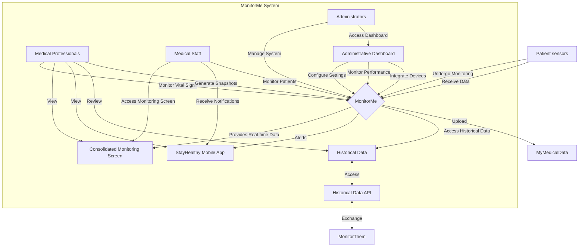

## Proposed scenarios
Proposed scenarios by actors

### Medical Professionals:
1. **Login and Access System**:
   - Log in to the MonitorMe system using unique credentials.
   - Access the dashboard to view patients' vital signs and alerts.

2. **Monitor Vital Signs**:
   - Monitor real-time vital signs of assigned patients.
   - Review data displayed on the consolidated monitoring screen.

3. **Respond to Alerts**:
   - Receive push notifications on the StayHealthy mobile app regarding abnormal vital signs.
   - Respond promptly by accessing patient data and taking necessary actions.

4. **Review Historical Data**:
   - Access historical data to analyze trends and patterns in patients' vital signs.
   - Filter data by time range and vital sign parameters as needed.

5. **Generate Patient Snapshots**:
   - Generate holistic snapshots of patients' vital signs for detailed analysis.
   - Upload snapshots securely to MyMedicalData for long-term record-keeping.

### Medical Staff:
1. **Login and Access System**:
   - Log in to the MonitorMe system using provided credentials.
   - Access the consolidated monitoring screen to view patients' vital signs.

2. **Receive Notifications**:
   - Receive push notifications on the consolidated monitoring screen for abnormal vital signs.
   - Take necessary actions based on the received alerts.

3. **Utilize Monitoring Screen**:
   - Monitor patients' vital signs displayed on the monitoring screen.
   - Rotate between patients' data to ensure thorough monitoring.

### Administrators:
1. **Login and Access System**:
   - Log in to the MonitorMe system using administrator credentials.
   - Access administrative dashboard for system management.

2. **Configure System Settings**:
   - Configure alert thresholds, user permissions, and system preferences.
   - Ensure proper integration with MyMedicalData for data upload.

3. **Monitor System Performance**:
   - Monitor system performance metrics to ensure optimal operation.
   - Address any issues or errors encountered during monitoring.

4. **Integrate New Devices**:
   - Integrate new vital sign monitoring devices into the system.
   - Update configurations and settings as necessary for seamless integration.

### Patients:
1. **Undergo Monitoring**:
   - Undergo continuous monitoring of vital signs by the MonitorMe system.
   - Experience improved patient care and safety due to real-time monitoring.

2. **Contribute to Data Generation**:
   - Provide data through wearable sensors and IoT devices for real-time monitoring.
   - Indirectly contribute to the system's data analysis and decision-making processes.

