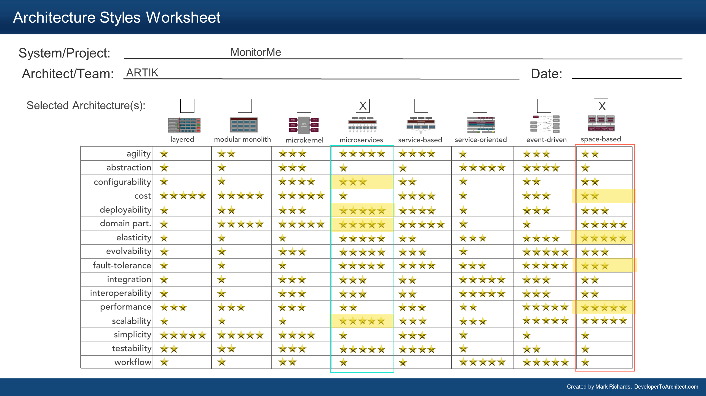

# Overall Architecture Style Analysis

## Identified Key Architectural Characteristics

The [key considerations and characteristics](../1.ProblemOverview/2.ConsiderationsAndDataCriticality.md) that were identified help us to select and overall architecture style. The top four are shown in bold and with a ^.

- **Cost ^**
- **Data Integrity ^**
- Scalability
- **Elasticity ^**
- Configurability
- **Performance ^**
- Fault Tolerance

## Architecture Capabilities Comparison

The above characteristics are highlighted below in green, with data integrity, above, not included in the matrix below. Data integrity will be a key architecture characteristic of the datastores, along with the interface to those data store.

[original comparison matrix from [DeveloperToArchitect.com](https://www.developertoarchitect.com/downloads/worksheets.html)]

## Architecture Capabilities Analysis

The above matrix gives us two candidates for our architecture, which need further analysis:

### Space-based

| Pros                                                         | Cons                                                         | Mitigations                                                  |
| ------------------------------------------------------------ | ------------------------------------------------------------ | ------------------------------------------------------------ |
| Scores highly on performance and deployability, very important for real time tracking computation. | Middling score on fault-tolerance, which would be a big trade-off for a central monitoring system | Integration and Interoperability are concerns, scoring low, but it is integration of the monitoring of standardized devices that is important and not of the system as a whole. 
| Middling score on fault-tolerance, important because of criticality of the data. Make sure the patient monitoring is not disrupted by a faulty device. | The middling fault-tolerant ability can be mitigated by using a temporal redundancy mechanism.
| | Requires that the system database not being too big. This would be complex to achieve and confirm. |
| | Also scores badly on cost and simplicity. Not key characteristics, but likely to be important to management and technologists respectively as StayHealthy is going into a new market.                                                             |                                                            

### Microservices

| Pros                                                         | Cons                                                         | Mitigations                                                  |
| ------------------------------------------------------------ | ------------------------------------------------------------ | ------------------------------------------------------------ |
| Scores highly on domain partitioning, very important for evolvability of the solution. | Scores low on performance, which would be a big trade-off for a elastic monitoring system. | Cost is a concern, scoring low, but the capacity of the system is already fixed. The scalability of the system is controlled by defined limits.
| Scores highly on fault-tolerance, important to make sure the patient monitoring is not disrupted by a faulty device. | Middling score on interoperability/integration, important because of integration with Mobile App and other systems. | The middling interoperability ability can be mitigated by using an interface for integration with other systems. 
|                                                         | Requires that the database be split along with each microservice. This would be another important trade-off. |                                                             |

## Conclusion

Both architecture options have trade-offs, but the trade-offs are affecting different scopes of the solution and can be mitigated by each other strength.

### Decision

ADR: [000 Combine-2-architecture-patterns](../3.ARDs/000.Combine2ArchitecturePatterns.md)

---