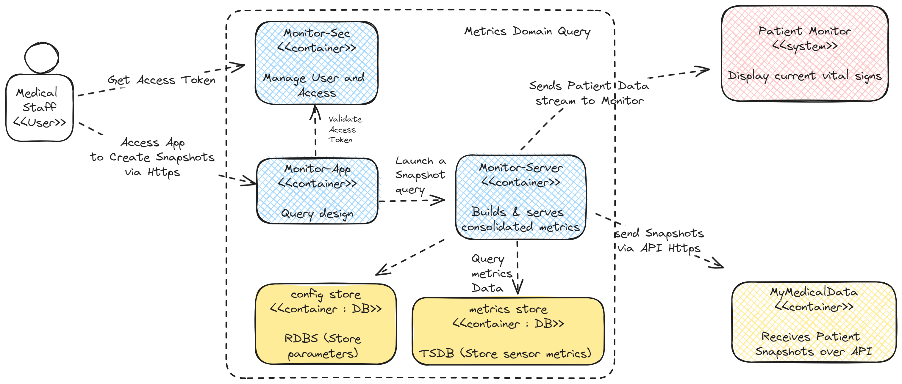

# C4 Models

A C4 model is a common set of abstractions used to describe the static structure of a software system; these abstractions having four levels: **software system**, **containers**, **components** and **code**. **People** that use the software system.

The following diagrams use the C4 standard.

## C4 Model Legend

## System Context Diagram

A **System Context** diagram provides a starting point, showing how the software system in scope fits into the world around it. 
This diagram shows how the main users of MonitorMe interact with the system, and how it interacts with other systems.

## Container Diagram

A Container diagram zooms into the software system in scope, showing the high-level technical building blocks. The following diagram breaks down the MonitorMe systems into functionalities, and shows how they interact with each other and how the users of the system interact with the functionality.

## Component Diagrams

A **Component** diagram zooms into an individual container, showing the components inside it.
The following diagrams break down the containers/functionality shown above further, into components which represent individually deployable services.

### Relevant ADRs

- [000 Combine Architecture patterns for monitoring devices (Sensor Unit) deployement and loose coupled business services](../../3.ARDs/000.Combine2ArchitecturePatterns.md)
- [004 Database types (metrics storage as TSDB / config storage as RDBS)](../../3.ARDs/004.DataStorageandRetrievalADR.md)

### Alert Processing

The following diagram shows the individually deployable services in the Alert processing domain

#### Relevant ADRs

- [005 Connect Alert processing with analytics for predictive capbilities](../../3.ARDs/005.AnalysisandAlertingMechanismADR.md)

### Metrics query and visualization

The following diagram shows the individually deployable services in the metrics query domain

#### Relevant ADRs

- [002 use a token based security through every service call](../../3.ARDs/002.SecurityAsAServiceADR.md)
